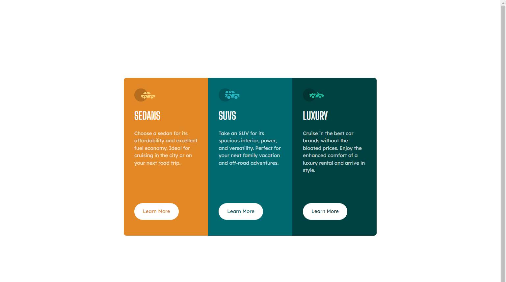

# Frontend Mentor - 3-column preview card component solution

This is a solution to the [3-column preview card component challenge on Frontend Mentor](https://www.frontendmentor.io/challenges/3column-preview-card-component-pH92eAR2-). Frontend Mentor challenges help you improve your coding skills by building realistic projects. 

## Table of contents

- [Overview](#overview)
  - [The challenge](#the-challenge)
  - [Screenshot](#screenshot)
  - [Links](#links)
- [My process](#my-process)
  - [Built with](#built-with)
  - [What I learned](#what-i-learned)
  - [Continued development](#continued-development)
- [Author](#author)

**Note: Delete this note and update the table of contents based on what sections you keep.**

## Overview

### The challenge

Users should be able to:

- View the optimal layout depending on their device's screen size
- See hover states for interactive elements

### Screenshot



### Links

- Solution URL: [Solution URL](https://github.com/bhaveshdaswani93/3-column-preview-card-component-main)
- Live Site URL: [Live URL](https://3-column-preview-card-component-main-one-ruddy.vercel.app/)

## My process

### Built with

- Bootstrap
- Semantic HTML5 markup
- CSS custom properties
- Flexbox
- Mobile-first workflow

### What I learned

Using Bootstrap to Layout the 3 Column Layout

```css
.row-custom {
  max-width: calc(768/16 * 1rem);
}
```

### Continued development

Bootstrap usage

### Useful resources

## Author

- Frontend Mentor - [@bhaveshdaswani93](https://www.frontendmentor.io/profile/bhaveshdaswani93)
